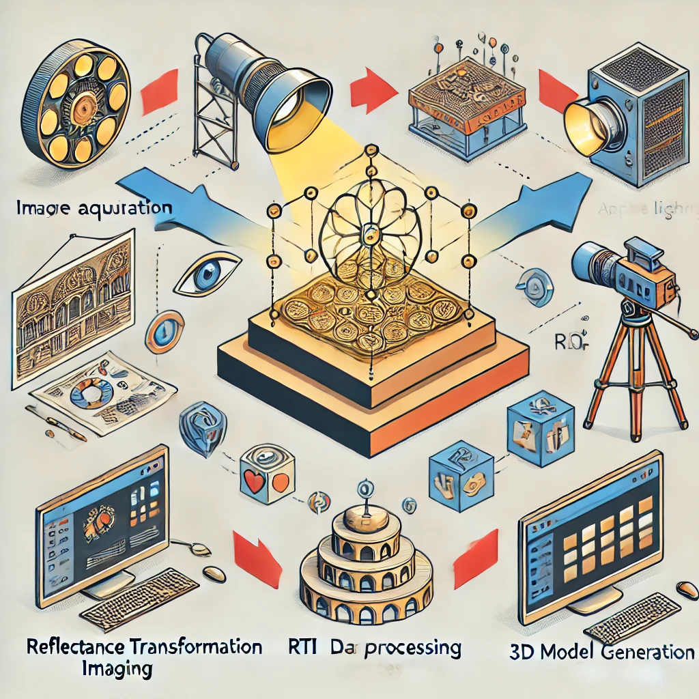

# 3d-rti

<p align="center">
    <a href="STATUS" alt="status">
        </a>    
    <a href="PLATFORM" alt="Platform">
        </a>  
    <a href="CONTRIBUTORS" alt="Contributors">
        </a>                
</p>

This repository provides tools and code for generating 3D images using Reflectance Transformation Imaging (RTI)




## Authors

- [Ramamoorthy Luxman](https://github.com/ramamoorthyluxman)
- [Deivid Botina](https://github.com/deividbotina-alv)

## Prerequisites

Before you begin, ensure you have met the following requirements:

- [Python 3.9.13](https://www.python.org/downloads/release/python-3913/) or higher installed.
- [virtualenv](https://virtualenv.pypa.io/en/latest/) installed (for creating a virtual environment).

### Installation

1. Clone the repository to your local machine:
    ```bash
    git clone git@github.com:rti-team-imvia/3d-rti.git
    ```

2. Navigate to the project directory:
    ```bash
    cd 3d-rti
    ```

3. Create a virtual environment (recommended):
- Windows(MINGW64):
    ```bash
    python -m venv .venv
    ```
- Linux:
    ```bash
    virtualenv .venv
    ```

4. Activate the virtual environment:
- Windows (MINGW64):
    ```bash
    source .venv/Scripts/activate
    ```
- macOS and Linux:
    ```bash
    source venv/bin/activate
    ```

5. Install the required dependencies:
    ```bash
    pip install -r requirements.txt
    ```

## Usage

You can run 3d-rti by using the following entries:

|    Input        | Tag         | Type         | Description  | Default |Required|
| :-------------- |:-------------|:-------------|:-------------|:--------|:-------|
| `--XXXXXX` | `-x`    |    str       |XXXXXXXXXXXXXXXXX | XXXXX | XXXX  |

